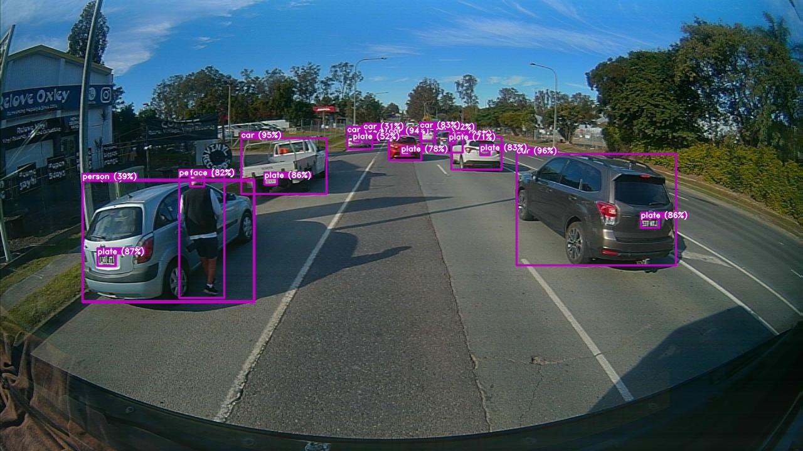

# 1. [Overview]

The first project I worked on at VisionHQ is the Anonymiser project. VisionHQ is a startup company that provides AI solutions for the urban planning industry. Some of the key projects include road safety, road hazard detection, etc.

The anonymizer project is about anonymising the sensitive data (i.e. pedestrian face, car number plate) from the taken images. This serves as a privacy protection mechanism for the company's products. If successful, the company will replace the current anonymiser (open-source model from a third party) with the in-house developed anonymiser. The new model is expected to surpass the old in terms of accuracy and speed, and ensures the data security.

Ideally, the anonymiser should be able to anonymise the sensitive data in real-time, as the images are taken from the on-board camera. The developed model should be able to run on the edge device (i.e. Jetson Nano) with limited computing power, but also remain high accuracy/recall.

# 2. [Responsibilities]

During the project, I was responsible for the following tasks:

- Collecting the dataset, and labelling the images (i.e. pedestrian face, car number plate, 6000 images in total).
- Researching the object detection models (i.e. YOLOv5 and its variants).
- Training the model on the collected dataset, using local machine for prototyping and training.

This is the very first project I worked on at VisionHQ. I was very excited about the project and eager to learn new things. Computer vision was a new field for me, and I had to learn everything from scratch. I spent a lot of time reading papers, watching tutorials, and experimenting with different models. I also learned how to use the annotation tool (i.e. LabelImg) to label the images. I was very happy with the progress I made during the project.

# 3. [Outcome]

Some sample images are shown below:

<table>
  <tr>
    <td>
      
    </td>
    <td>
      
    </td>
  </tr>
</table>

The project progressed well (image left showing the initial stage experiments, image right showing the final product) and the model is able to anonymise the sensitive data in real-time with high accuracy. The company is very satisfied with the result and deployed the model to the production pipeline.
