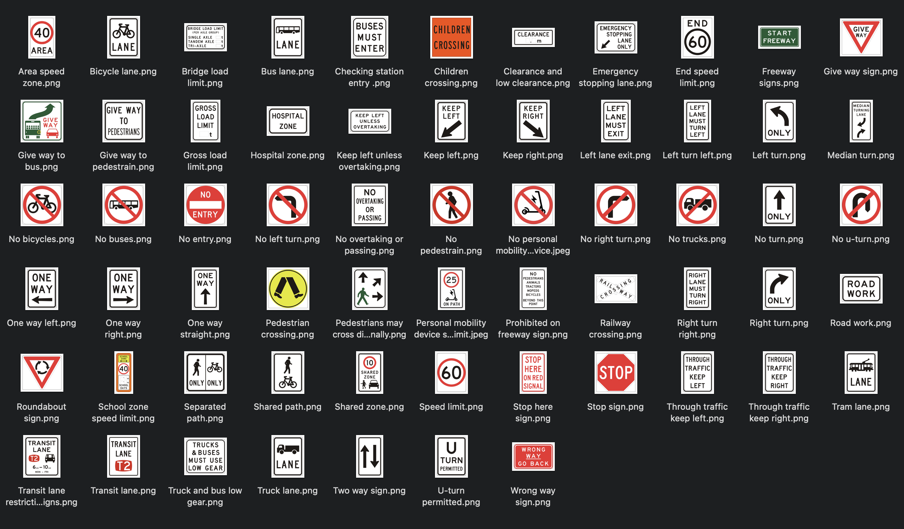

# 1. [Overview]

The second project I worked on at VisionHQ is the Broken Signage project. The project is about detecting broken signage from the taken images. This project is a part of the road safety project, is aiming to provide the urban planner with the information about the location, type, and severity of the broken signage. In this way, the urban planner can take actions to fix the broken signage, and improve the road safety. 

Some initial discussions have been made with the client, and we discussed the following points:
- The model does not need to be real-time, as the images are taken from the on-board camera and can be processed offline. Real-time does not provide much value in this case.
- Data collection is the most time-consuming part and most difficult part. There is no existing dataset for this task, and we need to collect the data ourselves. The only way to collect the data is to browse the existing video footage and take screenshots of the broken signage. 
- Signage can be broken in many ways, and we need to label them accordingly. Moreover, the types of signage varies, with more than 100 types of signage in total. 

# 2. [Responsibilities]

During the project, I was responsible for the following tasks:

- Research on types of signage, and the possible ways they can be broken (i.e. broken pole, graffiti, etc.).
- Collecting the dataset, and labelling the images (label them according to the type of signage, shape, and severity of the damage).
- Training the model on the collected dataset, using YOLOv5 and local machine.

During the development of this project, I already had some experience with computer vision and the MLops pipeline. I was able to quickly get started with the project and make progress. I worked closely with the team to discuss the project requirements, and the possible solutions. The concept of the project is quite similar to the previous project (i.e. Anonymiser), but the data collection part is much more difficult. I spent a lot of time designing the data collection process, and labelling the images. This is a rewarding experience.

# 3. [Outcome]

Some sample images are shown below:

The project itself was a success. The model is able to detect the broken signage with high accuracy. The company is awaiting the new mapping tool to be developed, and will deploy the model to the production pipeline next year.