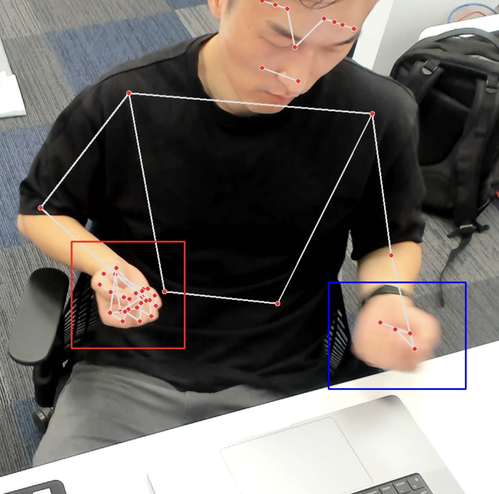
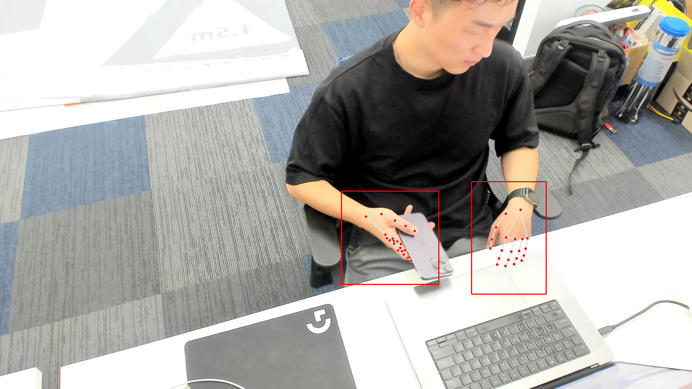

# 1. [Overview]

The third project I worked on is the driver behavior monitoring project. The project is about detecting the public service driver's irregular behavior from the in-car camera. This is aiming to provide the public service company feedback about their driver's behavior, and improve the road safety. Due to the nature of the project, privacy protection is the top priority. The model inference should be done on the edge device only.

Irregular behavior includes:

- Driver not wearing seatbelt.
- Driver using mobile phone while driving.
- Driver smoking while driving.
- Driver not wearing uniform.
- and more ...

Due to the privacy concern, this project is on-hold. The company is waiting for the client's approval before proceeding with the project.

# 2. [Responsibilities]

The company made it clear that this is a prototype project, mainly for demonstrating the client the capability of the company. The privacy concern and ethical concern are the top priority. It is likely that the project will be on-hold, and this is not urgent. Therefore, I was given a lot of freedom to explore different solutions, and experiment with different models. I worked solo on this project, and I was responsible for the following tasks:

- Designing the project skeleton.
- Mimicking the driver cabin environment and collecting the dataset.
- Researching the object detection models (i.e. Google MediaPipe, YOLOv5 and its variants).
- Developing the model.

# 3. [Outcome]

During the development, I found the project to be much more difficult than I expected. Plain classification models are not suitable as there are too much classes and too few data. Data collection can only be done in a way to mimic the driver cabin environment, i.e. having a camera taking photo from a similar angle/height. Seatbelt detection and uniform detection require the model to be able to detect the human body, which is a difficult. I spent a lot of time researching the possible solutions, and experimenting with different models.

Lucky enough, I found a model called [MediaPipe](https://google.github.io/mediapipe/solutions/pose.html) from Google. It is a pose estimation model, which is able to detect the human body and the human pose. I was able to use this model to detect the pose of a driver and then within each body part, I can detect the existence of seatbelt, uniform, etc. This is a very good solution, as it does not require any training data, and it is very accurate.

At the end, I was able to develop a prototype model that is able to detect the driver's irregular behavior such as holding a mobile phone, not wearing seatbelt, etc. The model is able to run locally on the edge device. The company is very satisfied with the result and shown the client the prototype. The client is impressed with the capability, and is considering to proceed with the project.

<table>
  <tr>
    <td>
      
    </td>
    <td>
      
    </td>
  </tr>
</table>
